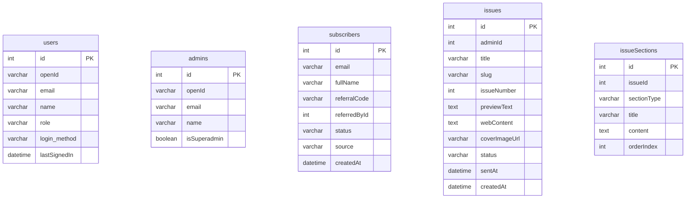

# NexusAI Digest — Pakistan's Premier AI Newsletter Platform

NexusAI Digest is a high-end, production-ready, AI-driven newsletter management platform built to compose, translate, edit, send, and optimize weekly briefings for Pakistani business leaders and developers. It features a modern dark-mode user experience, deep FastAPI REST integrations, automated AI writing companions using Groq, and a localized referral reward system.

---

## 🚀 Key Features

### Public Portal
* **Animated Multi-Step Subscriptions**: Modern interactive subscription flow with validation checks, referral codes tracking, and verification status loops.
* **Token Verification Check**: Dedicated validation views welcoming users, showing referral statistics, and reward milestones.
* **Exit Surveys**: Detailed exit reviews capturing user feedback during unsubscribing, with one-click resubscribe recovery.
* **Referrals Invitation Landing**: Custom invitation pages displaying milestone progress to incentivize signups.
* **Issue Archive & Reader**: Fully search-filtered archives and reader with complete sanitization and Twitter/LinkedIn social share modules.

### Admin Operations Control Center
* **Metrics Dashboard**: Quick-view widgets tracking growth rates, CTRs, and open rates, coupled with interactive Recharts graphics.
* **Issue Editor & Compiler**: Dual-pane layout featuring text markdown editing on the left and a live-updating compiled html preview (via Streamdown) on the right.
* **AI Writing Companion**: Instantly draft Pakistan spotlights, deep dives, news roundups, Urdu localized briefs, and compelling email subject lines using Groq API (Llama 3.3).
* **Audience Management**: Table with inline filters, detailed status flags (Active, Pending, Unsubscribed), and CSV export actions.
* **Sponsors Booking**: Schedule and track sponsorship slots across issues, calculate CTR impressions, and manage payment statuses.
* **Referrals Tracker**: View advocate leaderboards, referral counts, and milestones claims.

---

## 🛠️ Tech Stack & Architecture

### Frontend
* **Core**: React 19 (Vite), TypeScript, Wouter Client Routing
* **Style & Theming**: Tailwind CSS, Shadcn UI Primitives, Lucide Icons, Framer Motion transitions
* **Charts**: Recharts Area and Bar representations
* **Compiler**: Streamdown markdown parser, DOMPurify HTML sanitizer
* **API Client**: Axios + TanStack React Query v5 (proxied to Python backend in development)

### Backend & Database
* **Core Server**: Python FastAPI (Uvicorn / Gunicorn)
* **ORM & Database**: SQLAlchemy (asyncio) + SQLite (local) or PostgreSQL/MySQL (production)
* **AI Orchestrator**: Groq Cloud API (Llama 3.3) integration with dynamic fallback models
* **Email Delivery**: Resend API integration

---

## 📋 Database Schema



---

## ⚙️ Environment Configuration

Create a `.env` file in the root directory based on the `.env.example` template:

```bash
# Database Configuration
DATABASE_URL="sqlite+aiosqlite:///./database.db"

# Authentication Settings (JWT)
JWT_SECRET="generate_a_random_jwt_secret_here_for_production"

# Google OAuth Credentials
GOOGLE_CLIENT_ID="your_google_client_id"
GOOGLE_CLIENT_SECRET="your_google_client_secret"
GOOGLE_REDIRECT_URI="http://localhost:8000/api/auth/google/callback"

# Authorized Admin Emails (comma-separated list)
ADMIN_EMAILS="admin@nexusdigest.pk,your-email@gmail.com"

# Groq Cloud API LLM Settings
GROQ_API_KEY="your_groq_api_key"
GROQ_API_URL="https://api.groq.com/openai/v1/chat/completions"

# Server Execution Environment
PORT=8000
FRONTEND_URL="http://localhost:3000"

# Resend API Key for Email Delivery
RESEND_API="your_resend_api_key"
```

---

## 💻 Local Development

### 1. Installation
Install frontend packages:
```bash
pnpm install
```

Install backend dependencies using Python virtual environment:
```bash
cd backend
python -m venv venv
# On Windows PowerShell:
.\venv\Scripts\Activate.ps1
# On Linux/macOS:
source venv/bin/activate

pip install -r requirements.txt
cd ..
```

### 2. Database Auto-Initialization
The Python FastAPI application automatically initializes and updates the database schema (creating SQLite/PostgreSQL/MySQL tables) on startup using the database lifespan configurations. No manual migrations are required to get started locally!

### 3. Execution
Start both services for local developer loop:

#### Start Backend (Terminal 1)
```bash
cd backend
# Activate virtualenv
.\venv\Scripts\Activate.ps1
# Start FastAPI development server
uvicorn app.main:app --reload --port 8000
```

#### Start Frontend (Terminal 2)
```bash
# Runs Vite client on port 3000, which proxies /api requests to port 8000
pnpm dev
```

---

## 🚀 Production Deployment & SPA serving

1. Build static production assets:
   ```bash
   pnpm build
   ```
   This compiles the React SPA to the `dist/public` folder.

2. Launch the FastAPI server:
   ```bash
   cd backend
   uvicorn app.main:app --host 0.0.0.0 --port 8000
   ```
   FastAPI automatically mounts `/assets` and handles wildcard routing to serve `index.html` for client-side routing, meaning only one server process is needed in production!
